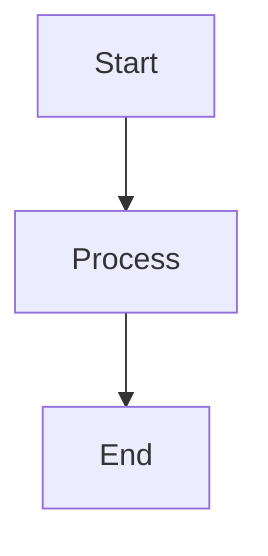

# CLAUDE.md

This file provides guidance to Claude Code (claude.ai/code) when working with code in this repository.

## Repository Overview

This is a course repository for ITAM's Artificial Intelligence class (Primavera 2026). It contains course materials, guides, and student assignments. The site is built using **uu_framework**, a custom static site generator based on Eleventy.

## Repository Structure

```
ia_p26/
├── clase/                    # Course content (rendered to site)
│   ├── 00_index.md           # Main index
│   ├── 01_*/                 # Numbered chapters
│   ├── a_stack/              # Appendix A: Technical stack
│   ├── b_libros/             # Appendix B: Books (gitignored, not rendered)
│   ├── 07_certificaciones/   # Certification guides
│   └── flow.sh               # Git workflow script
├── estudiantes/              # Student work (not rendered)
├── uu_framework/             # Static site framework
│   ├── config/               # Site & theme configuration (YAML)
│   ├── scripts/              # Python preprocessing (orchestrator + extractors)
│   ├── eleventy/             # Eleventy SSG (config, templates, styles)
│   │   ├── .eleventy.js      # Main Eleventy configuration
│   │   ├── _includes/        # Nunjucks templates & layouts
│   │   ├── _data/            # Generated JSON files (metadata, hierarchy, tasks)
│   │   └── src/              # Source CSS (Tailwind + themes)
│   ├── docker/               # Docker build environment
│   └── docs/                 # Framework documentation (dev/profesor/estudiante)
├── _site/                    # Built output (gitignored)
└── CLAUDE.md                 # This file
```

## uu_framework Architecture

### Build Pipeline

The build process runs in three sequential phases:

```
Phase 1: Python Preprocessing (scripts/preprocess.py)
   ├── generate_landing_page()     → clase/README.md (from root README.md)
   ├── extract_metadata.py          → _data/metadata.json (frontmatter + file info)
   ├── generate_indices.py          → _data/hierarchy.json (nav tree structure)
   ├── aggregate_tasks.py           → _data/tasks.json (homework/exams/projects)
   └── process_calendar_topics.py   → _data/calendar_topics.json

Phase 2: Eleventy Build (.eleventy.js)
   ├── Loads JSON data from _data/
   ├── Parses markdown (markdown-it + plugins)
   │   ├── markdown-it-container  → :::homework, :::exercise, etc.
   │   ├── markdown-it-attrs      → {.class #id} syntax
   │   └── markdown-it-anchor     → heading anchors
   ├── Renders with Nunjucks templates (_includes/)
   ├── Copies static assets (images, PDFs, fonts)
   └── Outputs to _site/

Phase 3: Tailwind CSS (tailwind.config.js)
   ├── Processes src/css/main.css
   ├── Copies theme files (src/css/themes/*.css)
   └── Outputs to _site/css/
```

### Key Architecture Concepts

**Data Flow**: Python scripts extract data from markdown frontmatter and content, generating JSON files that Eleventy templates consume via the `_data/` directory. This separation allows content changes to trigger minimal rebuilds.

**Content Exclusions**: Files matching patterns in `uu_framework/config/site.yaml` (like `b_libros/`, `flow.sh`, `??_*` directories) are excluded from rendering but may still be present in the repository.

**Path Prefix**: Auto-detected from git remote (e.g., `/ia_p26/`). The framework reads the repository name from `git config --get remote.origin.url` during preprocessing and generates `repo.json`, which Eleventy uses for URL prefixing. Configurable via `site.yaml` or `PATH_PREFIX` environment variable.

### File Naming Convention

| Pattern | Meaning | Example |
|---------|---------|---------|
| `00_*.md` | Index file | `00_index.md` |
| `01_`, `02_` | Chapters (ordered) | `01_intro/` |
| `a_`, `b_` | Appendices | `a_stack/` |
| `??_*` | Work-in-progress (hidden) | `??_draft/` |

### Markdown Components

Use container syntax for special content blocks:

```markdown
:::homework{id="hw-01" title="Task Name" due="2026-02-01" points="10"}
Assignment instructions...
:::

:::exercise{title="Exercise Title"}
Exercise steps...
:::

:::prompt{title="LLM Prompt"}
Prompt text to copy...
:::

:::example{title="Example"}
Example content...
:::

:::exam{id="exam-01" title="Exam Name" date="2026-03-15"}
Exam information...
:::

:::project{id="proj-01" title="Project Name" due="2026-05-15"}
Project description...
:::
```

### Mermaid Diagrams

Mermaid diagrams are auto-rendered:

````markdown

````

## Key Commands

### Docker Build Commands

All Docker commands must be run from the repository root:

```bash
# Start dev server with hot reload (most common)
docker compose -f uu_framework/docker/docker-compose.yaml up dev
# → Runs preprocessing (auto-detects repo), builds site, starts BrowserSync
# → Watches for file changes and auto-rebuilds

# Production build (for deployment)
docker compose -f uu_framework/docker/docker-compose.yaml run build
# → Runs full build pipeline: preprocess → eleventy → tailwind → asset copy

# Debug preprocessing only
docker compose -f uu_framework/docker/docker-compose.yaml run preprocess
# → Runs only Python scripts, outputs JSON to _data/ with --verbose flag
```

**Important**: Dev server runs at `http://localhost:3000/{repo-name}/` (e.g., `http://localhost:3000/ia_p26/` for this repo).

### Git Workflow Script (flow.sh)

Student-focused wrapper for common Git operations:

```bash
./clase/flow.sh setup              # Configure upstream remote + create user folder
./clase/flow.sh sync               # Pull from upstream/main → push to origin/main
./clase/flow.sh start <task-name>  # Sync + create new branch from main
./clase/flow.sh save "message"     # Stage all + commit with message
./clase/flow.sh upload             # Push current branch to origin
./clase/flow.sh finish             # Return to main, sync, optionally delete branch
./clase/flow.sh copy <src> <dest>  # Copy files with safety checks
```

**Upstream repository**: Auto-detected from git remote (for this repo: `git@github.com:sonder-art/ia_p26.git`)
**Student workflow**: Work in `estudiantes/<username>/`, commit to feature branches, push to personal forks, create PRs to upstream.

## Development Guidelines

### When Modifying the Framework

Key files to understand when making framework changes:

1. **Eleventy config** (`uu_framework/eleventy/.eleventy.js`):
   - Custom markdown-it containers (:::homework, :::exercise, etc.)
   - Filters: `formatDate`, `renderMarkdown`, `getNavNumber`, `cleanNavTitle`
   - Collections: content filtering logic, exclusions
   - Transforms: `.md` link rewriting
   - Passthrough copy rules for PDFs, images, fonts

2. **Templates** (`uu_framework/eleventy/_includes/`):
   - `layouts/base.njk`: Main page wrapper
   - Navigation components consume `hierarchy.json`
   - Task pages consume `tasks.json`

3. **Preprocessing** (`uu_framework/scripts/`):
   - `preprocess.py`: Orchestrator that runs all extractors
   - Modify extractors to change what data is available to templates
   - JSON outputs land in `_data/` for Eleventy consumption

4. **Configuration** (`uu_framework/config/site.yaml`):
   - Exclusion patterns, theme settings, feature flags
   - Changes here require preprocessing rerun

### When Creating Content

1. **Follow file naming convention** for proper ordering (see table above)
   - `00_index.md` for directory landing pages
   - Numeric prefixes (`01_`, `02_`) for chapters
   - Letter prefixes (`a_`, `b_`) for appendices
   - `??_` prefix for work-in-progress (excluded from build)

2. **Use YAML frontmatter** for metadata:
   ```yaml
   ---
   title: "Page Title"
   summary: "Brief description"
   order: 10  # Optional override for sorting
   ---
   ```

3. **Use component syntax** for assignments:
   - `:::homework{id="hw-01" title="..." due="2026-02-01" points="10"}`
   - `:::exercise{title="..."}`
   - `:::prompt{title="..."}` (includes copy button)
   - `:::example{title="..."}`
   - `:::exam{id="..." title="..." date="..."}`
   - `:::project{id="..." title="..." due="..."}`

4. **Markdown links**: Write as `[text](../path/file.md)` - Eleventy transforms to `[text](../path/file/)` automatically

5. **Images**: Place in nearest `images/` directory, reference as `` - Eleventy handles path resolution

### Language Guidelines

- **Framework code & dev docs**: English
- **Course content & user guides**: Spanish
- **Comments in code**: English preferred

## Documentation Structure

Documentation is organized by audience and rendered separately:

```
uu_framework/docs/
├── dev/           # Developer guides (English)
│   ├── Architecture, preprocessing, Eleventy internals
│   ├── Theming system, component development
│   └── Docker setup and troubleshooting
├── profesor/      # Professor guides (Spanish)
│   ├── Content structure, frontmatter reference
│   ├── Component usage (:::homework, :::exam, etc.)
│   └── Mermaid diagrams, best practices
└── estudiante/    # Student guides (Spanish)
    ├── Site navigation, accessibility features
    └── Submitting assignments, task tracking
```

These are processed separately from course content and rendered to `/docs/` URLs.

## Common Workflows

### Adding New Course Content

1. Create or modify markdown files in `clase/`
2. Follow naming conventions (`01_chapter/`, `00_index.md`)
3. Run dev server: `docker compose -f uu_framework/docker/docker-compose.yaml up dev`
4. Preview at `http://localhost:3000/{repo-name}/` (auto-detected)
5. Preprocessing runs automatically, auto-detects repo config, generates fresh JSON data

### Debugging Build Issues

```bash
# Check preprocessing output (verbose mode)
docker compose -f uu_framework/docker/docker-compose.yaml run preprocess

# Check generated JSON files
cat uu_framework/eleventy/_data/metadata.json
cat uu_framework/eleventy/_data/hierarchy.json
cat uu_framework/eleventy/_data/tasks.json

# Verify exclusion patterns
cat uu_framework/config/site.yaml
```

### Student Assignment Workflow

Students work in `estudiantes/<username>/`:
1. `./clase/flow.sh start tarea-X` - Create feature branch
2. Work in personal directory, commit changes
3. `./clase/flow.sh save "message"` - Commit work
4. `./clase/flow.sh upload` - Push to fork and create PR to upstream
5. After PR merge: `./clase/flow.sh finish` - Clean up and sync
