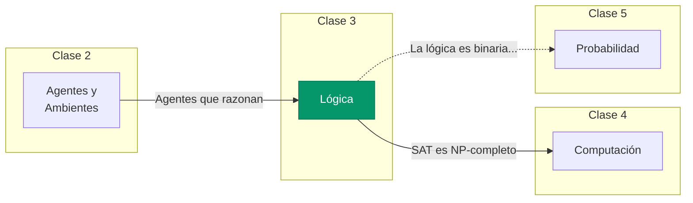

# Lógica: Razonamiento con Certeza

Aprendiendo a representar conocimiento y derivar conclusiones.

## ¿De Qué Trata Este Módulo?

Hasta ahora hemos visto qué es un agente y cómo interactúa con su ambiente. Pero los agentes más simples solo reaccionan — no **piensan**.

En este módulo aprenderemos cómo un agente puede:
- **Representar** lo que sabe de manera precisa
- **Derivar** nuevas conclusiones a partir de lo que sabe
- **Decidir** qué hacer basándose en su razonamiento

La herramienta que usaremos es la **lógica proposicional** — el lenguaje formal más simple para el razonamiento.

## Contenido del Módulo

| Sección | Tema | Pregunta Clave |
|:-------:|------|----------------|
| 3.1 | [Introducción](./01_intro.md) | ¿Por qué necesitamos lógica? |
| 3.2 | [Lógica Proposicional](./02_logica_proposicional.md) | ¿Cómo representamos conocimiento? |
| 3.3 | [Inferencia](./03_inferencia.md) | ¿Cómo derivamos conclusiones? |
| 3.4 | [Satisfacibilidad](./04_satisfacibilidad.md) | ¿Qué podemos computar? |
| 3.5 | [Wumpus World](./05_wumpus_world.md) | ¿Cómo aplicamos todo junto? |

## Objetivos de Aprendizaje

Al terminar este módulo podrás:

1. **Representar** afirmaciones del mundo real en lógica proposicional
2. **Evaluar** si una fórmula es verdadera o falsa en un modelo dado
3. **Aplicar** reglas de inferencia (Modus Ponens, Resolución) para derivar conclusiones
4. **Distinguir** entre fórmulas válidas, satisfacibles e insatisfacibles
5. **Convertir** fórmulas a Forma Normal Conjuntiva (CNF)
6. **Explicar** por qué SAT es NP-completo y qué significa esto
7. **Diseñar** un agente basado en conocimiento para el Wumpus World

## El Tipo de Agente que Construiremos

En este módulo trabajamos con **agentes basados en conocimiento**:

| Aspecto | Descripción |
|---------|-------------|
| **Qué tiene** | Una base de conocimiento (KB) con hechos y reglas |
| **Cómo decide** | Infiriendo nuevos hechos a partir de lo que sabe |
| **Ambiente ideal** | Determinista, donde los hechos son verdaderos o falsos |
| **Limitación** | No maneja incertidumbre ("probablemente", "tal vez") |

## Conexión con el Resto del Curso

- **Clase 2** definió qué es un agente
- **Clase 3** (este módulo) enseña a razonar con certeza
- **Clase 4** explorará los límites de lo computable (SAT es ejemplo clave)
- **Clase 5** extenderá el razonamiento para manejar incertidumbre

## Lecturas

Las lecturas del módulo están disponibles en el [Anexo de Lecturas](./a_lecturas.md).

| Libro | Capítulo | Páginas |
|-------|----------|:-------:|
| Artificial Intelligence: A Modern Approach (AIMA) | Ch 7: Logical Agents | 210-253 |

## Nota Histórica

> *"La lógica es el comienzo de la sabiduría, no su fin."*
> — Spock, Star Trek VI

La lógica formal tiene más de 2000 años, desde los silogismos de Aristóteles. En IA, el enfoque **logicista** dominó en los años 70-80 con los sistemas expertos. Aunque hoy usamos más métodos probabilísticos, la lógica sigue siendo fundamental para:

- Verificación de hardware y software
- Planificación automática
- Razonamiento formal en IA simbólica
- SAT solvers (usados en miles de aplicaciones industriales)
